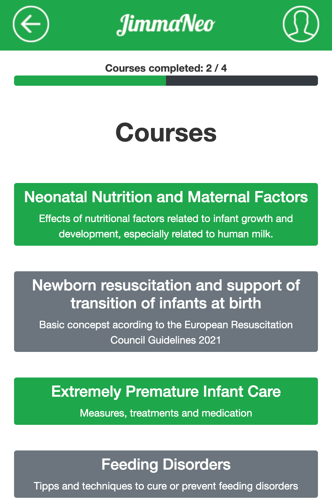

# Application Description
Our JimmaNeo application is designed to provide an enjoyable way of learning with the aspect of gamification at its center to motivate and encourage students to hang on and continue their learning efforts while also trying to focus on methods to provide an optimized learning effect with instant feedback and correction. 

To provide an idea of how our platform is looking to achieve these goals, the user interaction will be explained and backed up with corresponding screenshots along its logical procedural order.

## Landing Page, Courses and Lessons
The learning experience starts out at the **landing page** where an overview of all accessible courses as well as a general progress display regarding completed courses are shown to the student. A finished course will be displayed with a green background. If a student decides to work on a specific course, he can do so by clicking the associated button. 

By doing so, the student enters the **course page**. A course consists of one or multiple lessons which, as can be seen on the course page progress bar, all have to be completed before a course is marked as successfully finished. By using the navigation options in the header, the student is always able to go back one step or reach his profile with a single click.

When clicking the button of a specific lesson, the student enters the **lesson page** where an overview  of all the materials and components of a lesson is provided. A lesson usually consists of **documents, videos and quizzes**. The teachers have free choice over which, how many and if any of the specific components are part of a lesson. 

The materials in the documents section are usually PDFs or links to literature that require the student to actively familiarize themselves with the topic. By clicking on a document button, it will appear in a new browser tab. Videos from teachers or external tutors provide a passive learning method. Each video is capsuled in a collapsible element which can be opened and closed to keep a clean overview. The video itself can be directly played in the lesson page. Quizzes give students the opportunity to test their acquired knowledge. Each quiz can be accessed over its own button which will be highlighted in green when completed. 

 

*Pictures from left to right: Landing Page, Course Page, Lesson Page, Video in Lesson*

<kbd></kbd>
&nbsp; &nbsp; &nbsp; &nbsp; &nbsp; &nbsp; 
<kbd></kbd>
&nbsp; &nbsp; &nbsp; &nbsp; &nbsp; &nbsp; 
<kbd></kbd>
&nbsp; &nbsp; &nbsp; &nbsp; &nbsp; &nbsp; 
<kbd></kbd>

 

## Quizzes

Quizzes represent an essential part of the learning experience. They are the foundation of the progress control of our platform. A lesson is marked as completed when all of its quizzes have been done successfully.

 

**Quiz Procedure**

A Quiz begins on its starting page where the number of upcoming questions and a status if the student has already completed the quiz are shown. The starting of the quiz is initiated by clicking the "Start Quiz" button.

While in the quiz, the progress bar on top shows which question the student is on. Each question has its own answer set. The "Check" button at the bottom of the question evaluates the chosen answer and can only be clicked when the student hast selected an answer, indicating it is ready when glowing green. The selected answer will be highlighted in blue.

When the student decides to check his answer, the quiz will give instant feedback on whether the question was answered correctly or not to provide an optimal learning and memory effect. In case of a correct answer the corresponding answer button as well as the Check Button  will be highlighted in green.  If the answer was wrong, its button and the Check button will be highlighted in red with the correct answer blinking in green to show the student what would have been correct. By Clicking on the Continue button the next answer will be shown or when already on the last question the quiz will be finished.

When the student answers any answer correctly for the first time he will gain 10 Experience Points (EXP). If enough EXP have been earned, the student will level up. With increasing level the student can unlock new accessibles for his character (more on that in the next section). This is the main functionality and motivation of our gamification aspect.

 

*Pictures from left to right:*
 
*Row 1: Quiz Starting Page, Quiz Question, Selected Answer*
 
*Row 2: Correct Answer with earned EXP, Wrong Answer with correction, Level Up*

<kbd></kbd>
&nbsp; &nbsp; &nbsp; &nbsp; &nbsp; &nbsp; &nbsp; &nbsp; &nbsp;
<kbd></kbd>
&nbsp; &nbsp; &nbsp; &nbsp; &nbsp; &nbsp; &nbsp; &nbsp; &nbsp;
<kbd></kbd>
&nbsp; &nbsp; &nbsp; &nbsp; &nbsp; &nbsp; &nbsp; &nbsp; &nbsp;

 
<kbd></kbd>
&nbsp; &nbsp; &nbsp; &nbsp; &nbsp; &nbsp; &nbsp; &nbsp; &nbsp;
<kbd></kbd>
&nbsp; &nbsp; &nbsp; &nbsp; &nbsp; &nbsp; &nbsp; &nbsp; &nbsp;
<kbd></kbd>
&nbsp; &nbsp; &nbsp; &nbsp; &nbsp; &nbsp; &nbsp; &nbsp; &nbsp;

   

**Quiz Correction**

When the quiz has been finished, the student will be provided an overview of his performance. A message at the top tells whether the quiz was successfully completed or not. Below that a collapsible for each question will apper indicating if it was answered correctly. If clicked the collapsible will open and show the question title and correct answer as well as the students wrong answer if answered incorrectly. This overlooking correction method enables the student to reflect on his answers and make out potential difficulties and successes in his learning progress. He can return to the lesson with the given button at the bottom.

 

*Pictures from left to right: Correction Page, Correction Answers, Correction Completed Quiz*

<kbd></kbd>
&nbsp; &nbsp; &nbsp; &nbsp; &nbsp; &nbsp; &nbsp; &nbsp; &nbsp;
<kbd></kbd>
&nbsp; &nbsp; &nbsp; &nbsp; &nbsp; &nbsp; &nbsp; &nbsp; &nbsp;
<kbd></kbd>
&nbsp; &nbsp; &nbsp; &nbsp; &nbsp; &nbsp; &nbsp; &nbsp; &nbsp;

   

**Progress Update**

After successfully finishing the (only) quiz in the shown lesson, its button is highlighted in green and the lesson is now completed which can be seen at the progress bar in the lesson and the green highlighting of the lesson in the corresponding course page.

 

*Pictures from left to right: Completed Quiz in Lesson, Progress Bar of completed Lesson, Completed Lesson on Course Page*

<kbd></kbd>
&nbsp; &nbsp; &nbsp; &nbsp; &nbsp; &nbsp; &nbsp; &nbsp; &nbsp;
<kbd></kbd>
&nbsp; &nbsp; &nbsp; &nbsp; &nbsp; &nbsp; &nbsp; &nbsp; &nbsp;
<kbd></kbd>
&nbsp; &nbsp; &nbsp; &nbsp; &nbsp; &nbsp; &nbsp; &nbsp; &nbsp;

   

## Avatar

The avatar represents the students unique character. The Profile page shows details about the students profile such as username, description, collected EXP and current level. The avatar with its equipped and accessible accessories is shown below. As previously stated, the student can level up his avatar by correctly answering questions and earning EXP. By doing so, new accessories can be unlocked to equip which motivates the student to keep learning. By clicking on any accessory button, the specific item will be equipped or unequipped. With the level up in the shown quiz, the character can now eqip his new item (face mask). 

 

*Pictures from left to right: Profile Page, Avatar with new equipped item*

<kbd></kbd>
&nbsp; &nbsp; &nbsp; &nbsp; &nbsp; &nbsp; &nbsp; &nbsp; &nbsp;
<kbd></kbd>
&nbsp; &nbsp; &nbsp; &nbsp; &nbsp; &nbsp; &nbsp; &nbsp; &nbsp;

   

## Responsive Layout

Due to the fact that the majority of students in Jimma will be using the platform via a mobile device, our application has been designed to fit perfectly to mobile screen sizes (as seen in the previous screenshots). With the goal to provide an accessible and user friendly solution, the app has been designed to be hardware independent though and can responsively adapt to desktop browsers as well.

 

*Picture: JimmaNeo application on desktop browser*

<kbd></kbd>
&nbsp; &nbsp; &nbsp; &nbsp; &nbsp; &nbsp; &nbsp; &nbsp; &nbsp;

   

