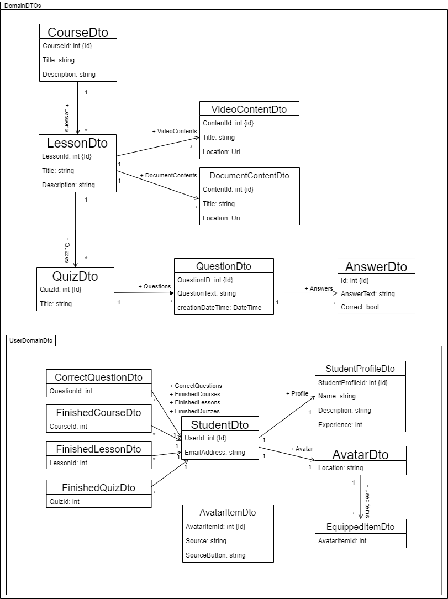

## Software Architecture
JimmaNeo is implemented as ASP.NET Core web application and follows the REST design principles. Therefore, the persistence and logic is separated from the frontend and implemented in the backend, known as server-client-model. The communication between frontend and backend uses HTTP requests and resources are delivered in JavaScript Object Notation (JSON).

# Backend
Backend is designed with three abstraction layers, the data access, the services, and the controllers. These three layers are not accessing each other directly, please see below.

**Data Access**

Data is stored as domain objects via Microsoft [Entity Framework Core](https://docs.microsoft.com/en-us/ef/core/). This allows to store .NET objects into relational databases and [supports many database engines](https://docs.microsoft.com/en-us/ef/core/providers/?tabs=dotnet-core-cli).

**Services**

The services are providing all backend features and logic and get passed the database context. They are registered in the built-in Inversion of Control (IoC)-Container and on account of this, all classes, which need the functions of these service, can get the service injected. Hence, it is possible to observe the single-responsibility-principle, while creating the dependencies at a central component, the `Startup.cs`. Simplified representation of dependency injection:

All self-implemented services are `AddScoped`, which means an instance of the service is created once per scope. A scope is created on every request to the application.
Registered self-implemented services:
* CourseService
* LessonService
* QuizService
* StudentService
* AvatarService
* AvatarItemService
* CorrectQuestionService
* FinishedQuizService

**Controllers**

The controllers are responsible to handle the incoming HTTP request from the client and so providing the API of the Backend.
Implemented backend server API:
* Avatar
    * **GET /api/Avatars/{id}**
    Get the avatar with the given UserId of a student as AvatarDto.
    * **PUT /api/Avatars/{id}**
    Update a avatar of the specific student - Response is the updated AvatarDto.
* AvatarItem
    * **GET /api/AvatarItems**
    Get all avatar items as AvatarItemDto[].
* CorrectQuestion
    * **GET /api/CorrectQuestions/{id}**
    Get all correctly answered questions of a specific student as CorrectQuestionDto[].
    * **PUT /api/CorrectQuestions/{id}**
    Add a correctly answered question to a specific student. The student gains experience, if a correctly answered question is added. Response is the added CorrectQuestionDto.
* Course
    * **GET /api/Courses/**
    Get all courses as CourseDto[].
    * **GET /api/Courses/{id}**
    Get course  with the given id as CourseDto.
* Lesson
    * **GET /api/Lessons/**
    Get all lessons as LessonDto[].
    * **GET /api/Lessons/{id}**
    Get lesson with the given id as LessonDto.
* Quiz
    * **GET /api/Quizzes/**
    Get all quizzes as QuizDto[].
    * **GET /api/Quizzes/{id}**
    Get quiz with the given id as QuizDto.
    * **GET /api/lesson/{lessonId}/quizzes**
    Get all quizzes of the lesson with given id as QuizDto[].
* Student
    * **GET /api/Students/**
    Get all students as StudentDto[].
    * **GET /api/Students/{id}**
    Get the student with the given id as StudentDto[].
    * **PUT /api/Students/{userId}/finishQuiz/{courseId}/{lessonId}/{quizId}**
    Add a finished quiz to an student. If now the lesson is finished, then this lesson is also added to the student. And again, if now the course is finished, then this course is also added to the student.

# Frontend
The frontend consists of Razor pages containing Blazorise items with no abstraction layer between the pages and the called backend services. Style items are pulled out to common style file.

**Shared**

Contains the data transfer objects, which are shared resources between front- and backend.

