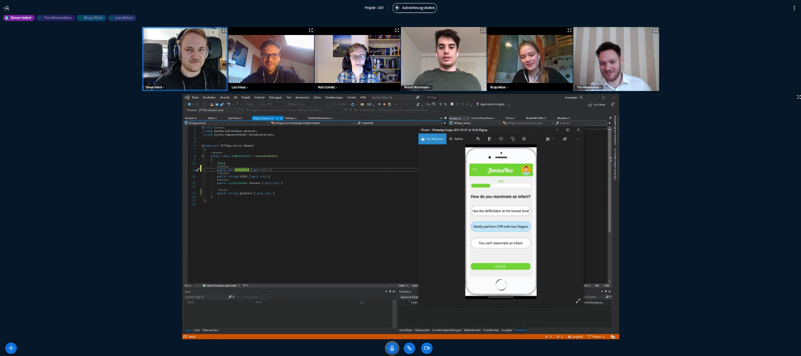

# Team and Contact Person

#### Contact Person: Ronja Meier (rmeier@hm.edu)

**Lars Kriese:** Backend

**Tim Hoehenleitner:** Backend

**Robert Wiechmann:** Frontend

**Simon Imhof:** Frontend

**Ronja Meier:** Frontend

**Maximilian Schmitz:** Frontend

### Functioning

We worked as an agile team and orientated ourselves towards scrum with short sprints of roughly a week.
Once a week we hold a review/planning meeting to talk about what problems occured and to discuss how we
would like to proceed and what is next to be implemented. That way of working together was the reason
why we managed to get a lot done during a short period of time and it kept the motivation of the team
always on a high level.